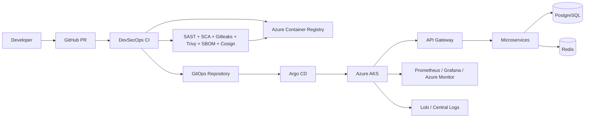

# Overall architecture

```mermaid
flowchart LR
D[Developer]-->GH[GitHub PR]
GH-->CI[DevSecOps CI]
CI-->ACR[Azure Container Registry]
CI-->GIT[GitOps Repository]
GIT-->ARGO[Argo CD]
ARGO-->AKS[Azure AKS]
AKS-->GW[API Gateway]
GW-->MS[Microservices]
MS-->PG[(PostgreSQL)]
MS-->R[(Redis)]
AKS-->MON[Prometheus / Grafana / Azure Monitor]
AKS-->LOG[Loki / Central Logs]
CI-->SEC[SAST + SCA + Gitleaks + Trivy + SBOM + Cosign]
SEC-->ACR
```
