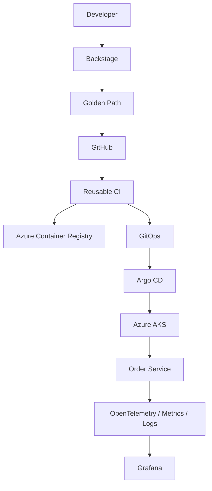

# Architecture

```mermaid
flowchart TD
  D[Developer] --> B[Backstage]
  B --> T[Golden Path]
  T --> G[GitHub]
  G --> CI[Reusable CI]
  CI --> ACR[Azure Container Registry]
  CI --> GO[GitOps]
  GO --> ARGO[Argo CD]
  ARGO --> AKS[Azure AKS]
  AKS --> APP[Order Service]
  APP --> O[OpenTelemetry / Metrics / Logs]
  O --> GRAF[Grafana]
```
